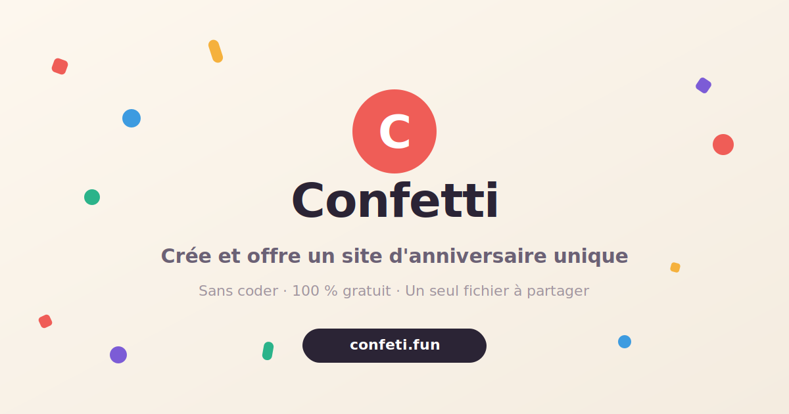

<p align="center">
  
</p>

<h1 align="center">Confeti</h1>

<p align="center">
  Creez, personnalisez et offrez un site de fete en un seul fichier HTML, sans coder.
</p>

<p align="center">
  <a href="https://github.com/DemeulemeesterxMaxime/confeti/actions/workflows/ci.yml"></a>
  <a href="https://github.com/DemeulemeesterxMaxime/confeti/actions/workflows/lighthouse.yml"></a>
  <a href="LICENSE"></a>
  <a href="https://www.confeti.fun"></a>
</p>

<p align="center">
  <a href="#creer-un-cadeau-en-3-etapes">Creer un cadeau</a> ·
  <a href="#demarrage-rapide">Demarrage rapide</a> ·
  <a href="#ajouter-un-modele">Ajouter un modele</a> ·
  <a href="#contribuer">Contribuer</a>
</p>

> **Open-source birthday website templates and celebration page builder.** Confeti est une galerie Astro de sites de fete narratifs a personnaliser dans le navigateur, puis a telecharger sous la forme d un unique fichier HTML autonome.

## Creer un cadeau en 3 etapes

1. Parcourez la [galerie](https://www.confeti.fun/galerie/) et choisissez un modele.
2. Personnalisez les textes, les photos et, si vous le souhaitez, la musique.
3. Telechargez le resultat : photos et audio sont integres dans un fichier `.html` pret a heberger ou a partager.

Le fichier fonctionne seul, meme hors ligne. Il est pense pour Safari iOS comme pour les navigateurs desktop.

## Ce que contient le projet

| Partie                       | Role                                                                                           |
| ---------------------------- | ---------------------------------------------------------------------------------------------- |
| **Galerie Astro**            | Decouverte des modeles, editeur dans le navigateur et guide de deploiement.                    |
| **Templates HTML autonomes** | Une page complete par modele, sans build requis pour le fichier offert.                        |
| **Editeur generique**        | Detecte `data-edit` pour les textes et `data-slot` pour les photos.                            |
| **Creation IA optionnelle**  | Point de depart pour generer un brief, avec endpoint OpenAI-compatible configure cote serveur. |

Les cas d usage couvrent les anniversaires, felicitations, fetes des meres ou des peres et toute invitation ou attention personnelle qui merite mieux qu un simple message.

## Demarrage rapide

Prerequis : Node.js **22.12+** et npm.

```bash
git clone https://github.com/DemeulemeesterxMaxime/confeti.git
cd confeti
npm ci
npm run dev
```

Ouvrez ensuite `http://localhost:4321`. Pour valider une contribution :

```bash
npm run lint
npm test
npm run format
npm run build
```

La CI execute lint, tests, couverture et build. Les pull requests recoivent aussi un audit Lighthouse ; les dependances et secrets sont controles par les workflows de securite et CodeQL.

## Ajouter un modele

Chaque modele est un dossier auto-decouvert au build :

```text
public/templates/mon-modele/
├── index.html  # requis, page autonome
├── meta.json   # optionnel : titre, description, auteur, accent
└── music.mp3   # optionnel, non versionne par defaut
```

Pour rendre le modele personnalisable dans la galerie :

- marquez les photos avec `data-slot="1"`, `data-slot="2"`, etc. ;
- marquez les textes avec `data-edit="cle"` ;
- conservez les garde-fous de scroll et de safe area iOS du modele existant.

Le guide complet se trouve dans [AGENT.md](AGENT.md). Il explique aussi comment conserver un scroll stable sur iPhone et comment verifier le fichier genere.

## Vie privee et hebergement

- La personnalisation des textes et photos se fait dans le navigateur.
- Le fichier final embarque ses medias et ne depend pas de Confeti pour fonctionner.
- L IA est optionnelle : elle utilise uniquement l endpoint configure par le deployeur.
- Pour publier le cadeau, glissez le fichier sur Netlify Drop ou hebergez-le sur Vercel, GitHub Pages ou tout hebergement statique.

Le site public expose deja `robots.txt`, sitemap, `llms.txt`, donnees structurees, `hreflang` FR/EN et une FAQ visible afin que les moteurs de recherche et assistants IA comprennent clairement le projet.

## Contribuer

Confeti est sous licence [MIT](LICENSE). La branche `main` reste la reference stable : les nouveaux templates et variantes se partagent dans une branche `template/<nom-court>` plutot que par merge direct vers `main`.

```bash
git checkout -b template/ma-variation
# ajoutez ou adaptez public/templates/ma-variation/
git commit -m "template: ajoute ma variation"
git push origin template/ma-variation
```

Lisez [CONTRIBUTING.md](CONTRIBUTING.md) avant de proposer un modele. N ajoutez jamais de photos personnelles ni de musique sous copyright dans le depot.

## Ressources

- [Galerie Confeti](https://www.confeti.fun/galerie/)
- [Creer avec IA](https://www.confeti.fun/create/)
- [Guide de deploiement](https://www.confeti.fun/deploy/)
- [Documentation pour agents IA](AGENT.md)
- [Changelog](CHANGELOG.md)

## FAQ

**Faut-il savoir coder ?** Non. La galerie permet de remplacer les textes, photos et musique avant le telechargement.

**Le site cree reste-t-il disponible si Confeti disparait ?** Oui. Le fichier HTML telecharge est autonome et peut etre heberge ou conserve localement.

**Puis-je creer mon propre template ?** Oui. Respectez la structure `public/templates/<slug>/`, les attributs `data-edit` et `data-slot`, ainsi que les contraintes iOS documentees.
